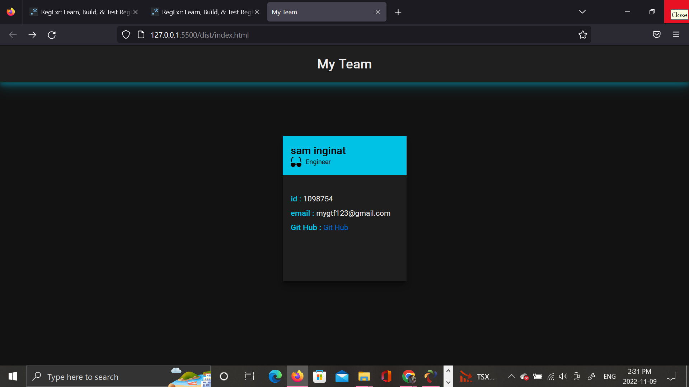

# myteam-profile-generator

# description

This is to build a Node.js command-line application that takes in information about employees on a software engineering team and generates an HTML webpage that displays summaries for each person.

# User Story

AS A manager
I WANT to generate a webpage that displays my team's basic info
SO THAT I have quick access to their emails and GitHub profiles

## Uesd packagers

- inquirer package
- jest package

# Github link

https://github.com/kusalaindika1/myteam-profile-generator

## video link

https://drive.google.com/file/d/1_-c7OlZhSkbwWLLYPfD-u6MS6vxpJnzj/view

# screenshort

